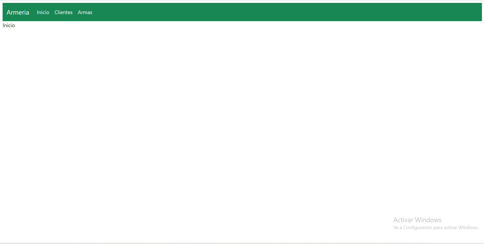
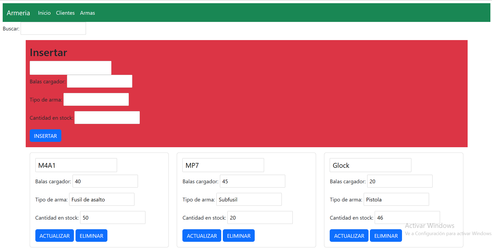
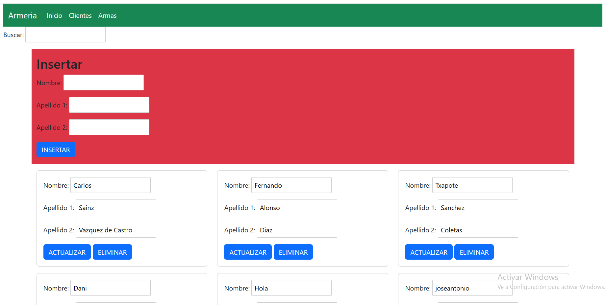

# Iniciación del proyecto (documentación generada automaticamente)

---

# svelte app

This is a project template for [Svelte](https://svelte.dev) apps. It lives at https://github.com/sveltejs/template.

To create a new project based on this template using [degit](https://github.com/Rich-Harris/degit):

```bash
npx degit sveltejs/template svelte-app
cd svelte-app
```

*Note that you will need to have [Node.js](https://nodejs.org) installed.*


## Get started

Install the dependencies...

```bash
cd svelte-app
npm install
```

...then start [Rollup](https://rollupjs.org):

```bash
npm run dev
```

Navigate to [localhost:8080](http://localhost:8080). You should see your app running. Edit a component file in `src`, save it, and reload the page to see your changes.

By default, the server will only respond to requests from localhost. To allow connections from other computers, edit the `sirv` commands in package.json to include the option `--host 0.0.0.0`.

If you're using [Visual Studio Code](https://code.visualstudio.com/) we recommend installing the official extension [Svelte for VS Code](https://marketplace.visualstudio.com/items?itemName=svelte.svelte-vscode). If you are using other editors you may need to install a plugin in order to get syntax highlighting and intellisense.

## Building and running in production mode

To create an optimised version of the app:

```bash
npm run build
```

You can run the newly built app with `npm run start`. This uses [sirv](https://github.com/lukeed/sirv), which is included in your package.json's `dependencies` so that the app will work when you deploy to platforms like [Heroku](https://heroku.com).


## Single-page app mode

By default, sirv will only respond to requests that match files in `public`. This is to maximise compatibility with static fileservers, allowing you to deploy your app anywhere.

If you're building a single-page app (SPA) with multiple routes, sirv needs to be able to respond to requests for *any* path. You can make it so by editing the `"start"` command in package.json:

```js
"start": "sirv public --single"
```

## Using TypeScript

This template comes with a script to set up a TypeScript development environment, you can run it immediately after cloning the template with:

```bash
node scripts/setupTypeScript.js
```

Or remove the script via:

```bash
rm scripts/setupTypeScript.js
```

If you want to use `baseUrl` or `path` aliases within your `tsconfig`, you need to set up `@rollup/plugin-alias` to tell Rollup to resolve the aliases. For more info, see [this StackOverflow question](https://stackoverflow.com/questions/63427935/setup-tsconfig-path-in-svelte).

## Deploying to the web

### With [Vercel](https://vercel.com)

Install `vercel` if you haven't already:

```bash
npm install -g vercel
```

Then, from within your project folder:

```bash
cd public
vercel deploy --name my-project
```

### With [surge](https://surge.sh/)

Install `surge` if you haven't already:

```bash
npm install -g surge
```

Then, from within your project folder:

```bash
npm run build
surge public my-project.surge.sh
```

# App.svelte

---
Lo primero que realizaremos sera instalar svelte-routing
```bash
npm install svelte-routing
```
Después instalamos bootstrap
```bash
npm install sveltestrap svelte bootstrap
```
Realizamos las importaciones de bootstrap, el contexto de svelte y svelte-routing
```js
import "bootstrap/dist/css/bootstrap.min.css";
import "bootstrap/dist/js/bootstrap.min.js";
import { setContext} from "svelte";
import { Router} from "svelte-routing";
```
Creamos en el contexto de svelte las rutas de la api
```js
const URL = {
        armas: "https://apiarmeria.onrender.com/api/armeria/armas",
        clientes: "https://apiarmeria.onrender.com/api/armeria/clientes"
    }
    setContext("URL", URL);
```
Indicamos las secciones de la web, que se correspondera a diferentes archivos de svelte
```sveltehtml
<Router>
    <Nav/>
    <Contenido/>
</Router>
```
# Nav.svelte

---
Importamos link al arhivo
```js
import { Link } from "svelte-routing";
```
Las etiquetas a las sustituimos por la siguiente etiqueta html
```sveltehtml
<Link to="/" class="nav-link text-light">Inicio</Link>
```
# Contenido.svelte

---
Importamos routes al archivo
```js
import { Route } from "svelte-routing";
```
Con la etiqueta route establecemos el contenido que se mostrara al usar los links establecidos en Nav.svelte indicando en component el archivo svelte al que corresponde y en path el link al que corresponde
```sveltehtml
<Route path="/" component="{Inicio}"></Route>
```
# store.js

---
Importamos writable y creamos una constante llamada data que hace uso de la función writable a la que le pasamos un array
```js
import { writable} from "svelte/store";

export const data = writable([]);
```
# Botones.svelte

---
Importamos la funcion onMount y data que es la que guarda el objeto que seleccionamos
```js
import { onMount} from "svelte";
import {data} from "../store.js";
```
Exportamos la varibles del tipo de boton, la url a la que le hace las peticiones http y documento que corresponde a un arma/cliente
```js
export let tipo;
export let url;
export let documento;
```
Creamos la funcion para insertar en la base de datos, donde en el body mandamos los datos lo que queremos insertar pasados a JSON y al insetarlos los incluimos en data
```js
function insertar() {
        const opciones = {
            method: "POST",
            headers: { "Content-Type": "application/json" },
            body: JSON.stringify(documento)
        }
        fetch(url, opciones).then(res => res.json())
            .then(doc => $data = [...$data, doc]).catch();
    }
```
Creamos la funcion para actualizar donde indicamos el metodo en method, el documento con los cambios en body pasado a JSON y en el fetch la url de la api seguida de la id del documento a actualizar
```js
function actualizar() {
        let opciones = {
            method: "PUT",
            headers: { "Content-Type": "application/json"},
            body: JSON.stringify(documento)
        }
        fetch(`${url}/${documento._id}`, opciones).then(res => res.json())
            .then(doc => console.log(doc))
            .catch();
    }
```
Creamos la funcion eliminar donde indicamos el metodo, y en el fetch indica la url seguida de la id del documento a eliminar, pasamos a json el documento que nos devuelve al eliminar y lo quitamos de data
```js
function eliminar() {
        let opciones = {
            method: "DELETE",
            headers: { "Content-Type": "application/json" }
        }
        fetch(`${url}/${documento._id}`, opciones)
            .then(res => res.json())
            .then($data = $data.filter(doc => doc._id != documento._id))
            .catch();
        console.log("Eliminar");
    }
```
Cremos una funcion que sera la que llamaremos al darle al boton y le indicaremos a la que corresponde con la funcion onSetup que es la que llamaremos en onMount
```js
let handler = () => {}
function onSetup() {
        if (tipo == "insertar") {
            handler = insertar;
        } else if (tipo == "actualizar") {
            handler = actualizar;
        } else if (tipo == "eliminar") {
            handler = eliminar;
        }
    }
    onMount(onSetup);
```
El boton html queda de la siguiente forma
```sveltehtml
<input type="button" value="{tipo.toUpperCase()}" on:click={handler} class="btn btn-primary">
```
# Busqueda.svelte

---
Exportamos la variable de busqueda
```js
export let busqueda = "";
```
Cremos la etiqueta html de busqueda
```sveltehtml
<input type="search" bind:value="{busqueda}"/>
```
# Arma/Cliente.svelte

---
Exportamos el documento correspondiente al formulario
```js
export let arma;
```
Creamos las etiquetas html
```sveltehtml
<h5 class="card-title"><input type="text" bind:value={arma.nombre}/></h5>
<p class="card-text">Balas cargador: <input type="number" bind:value={arma.balasCargador}/></p>
<p class="card-text">Tipo de arma: <input type="text" bind:value={arma.tipo}/></p>
<p class="card-text">Cantidad en stock: <input type="number" bind:value={arma.stock}/></p>
```
# Armas/Clientes.svelte

---
Realizamos las importaciones del contexto para obtener el enlace de la api, data para almacenar los documentos y onMount para iniciar una funcion al cargar.

```js
import { getContext} from "svelte";
import { data } from "../../store.js";
import { onMount} from "svelte";
```

Despues de esto creamos 3 variables, que son un objeto para la insercion, otro para los datos recuperados de la api y una cadena para la busqueda.  
Y tambien una constante donde guardaremos la URL que tenemos en el contexto.
```js
let armaInsert = {};
let datosFiltrados = {}
let busqueda = "";
const URL = getContext("URL");
```

Para obtener las armas cuando entremos a la pagina creamos una funcion que realiza un fetch a la api y guarda los datos en data y con onMount le decimos que quremos que se ejecute cuando lo iniciemos el componente.
```js
async function getArmas() {
    const response = await fetch(URL.armas);
    $data = await response.json();
}
onMount(getArmas);
```

Para poder realizar la busqueda, hemos insertado en datosFiltrados todos los objetos de data que correspondan con la cadena de busqueda.
```js
$: datosFiltrados = $data.filter( arma => RegExp(busqueda, "i").test(arma.nombre));
```

Para poder realizar la busqueda usamo el componente de busqueda y con bind y el nombre de la cadena especificamos que la variable busqueda del componente de busqueda corresponde al del componente en el que se usa.
```sveltehtml
<p>Buscar: <Buscador bind:busqueda/></p>
```

Para insertar, primero llamamos al formulario del objeto y especificamos con bind que, en este caso, armaInsertar de este componente corresponde a la varible exportada arma del componente Arma y para realizar la operacion llamamos al componente botones, al que le indicamos usando sus varibles exportadas el tipo de boton, el documento que usar y la url en la que actuar.
```sveltehtml
<Arma bind:arma={armaInsert}/>
<Botones tipo="insertar" documento="{armaInsert}" url="{URL.armas}"/>
```

Por ultimo mostramos los datos, haciendo uso de un each, que se encuentran en datosFiltrados donde estan todos los documentos si no indicamos nada y los documentos filtrados si hacemos uso de la busqueda.  
Cuando ya tenemos el documento por separado creamos el formulario asociado a ese documento indicando que el documento exportado de, en este caso, arma corresponde al arma obtenida del each de nuestro componente, por ultimo creamos los botones de actualizar y eliminar como lo hicimos en el anterior pero cambiando el tipo e indicando que el documento es el arma del each.
```sveltehtml
{#each datosFiltrados as arma }
            <div class="col-md-4">
                <div class="card mt-3">
                    <div class="card-body">
                        <Arma bind:arma/>
                        <Botones tipo="actualizar" documento="{arma}" url="{URL.armas}"/>
                        <Botones tipo="eliminar" documento="{arma}" url="{URL.armas}"/>
                    </div>
                </div>
            </div>
        {/each}
```

# Resultado final

---
Inicio  
  
Armas  
  
Clientes  
